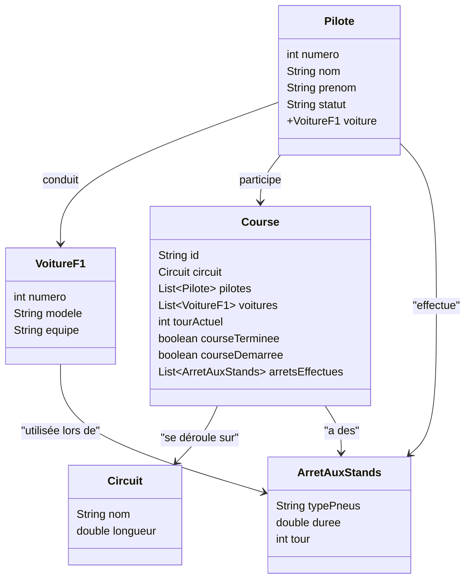

# Diagramme de classes (Mermaid)

```mermaid
classDiagram
    class Pilote {
        int numero
        String nom
        String prenom
        String statut
        +VoitureF1 voiture
    }
    class VoitureF1 {
        int numero
        String modele
        String equipe
    }
    class Course {
        String id
        Circuit circuit
        List~Pilote~ pilotes
        List~VoitureF1~ voitures
        int tourActuel
        boolean courseTerminee
        boolean courseDemarree
        List~ArretAuxStands~ arretsEffectues
    }
    class Circuit {
        String nom
        double longueur
    }
    class ArretAuxStands {
        String typePneus
        double duree
        int tour
    }
    Pilote --> VoitureF1 : conduit
    Pilote --> Course : participe
    Course --> Circuit : "se déroule sur"
    Course --> ArretAuxStands : "a des"
    Pilote --> ArretAuxStands : "effectue"
    VoitureF1 --> ArretAuxStands : "utilisée lors de"
```
