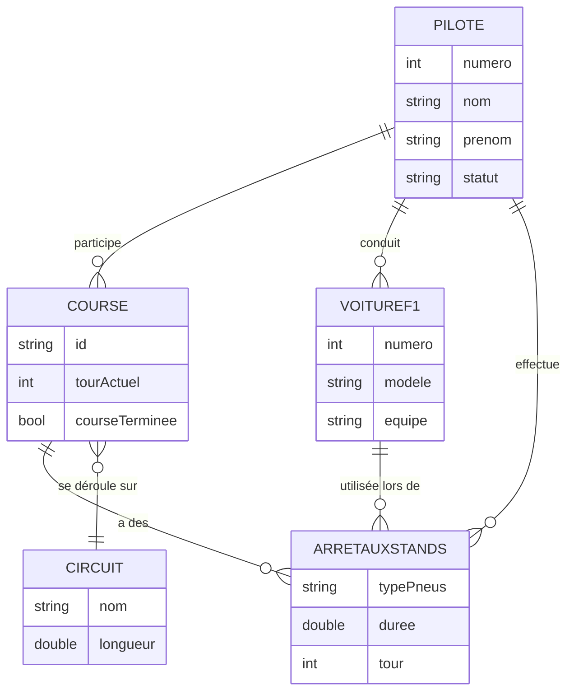

# Diagramme ERD (Mermaid)

```mermaid
erDiagram
    PILOTE ||--o{ COURSE : participe
    PILOTE ||--o{ VOITUREF1 : conduit
    COURSE ||--o{ ARRETAUXSTANDS : "a des"
    COURSE }o--|| CIRCUIT : "se déroule sur"
    VOITUREF1 ||--o{ ARRETAUXSTANDS : "utilisée lors de"
    PILOTE ||--o{ ARRETAUXSTANDS : "effectue"

    PILOTE {
        int numero
        string nom
        string prenom
        string statut
    }
    VOITUREF1 {
        int numero
        string modele
        string equipe
    }
    COURSE {
        string id
        int tourActuel
        bool courseTerminee
    }
    CIRCUIT {
        string nom
        double longueur
    }
    ARRETAUXSTANDS {
        string typePneus
        double duree
        int tour
    }
```
