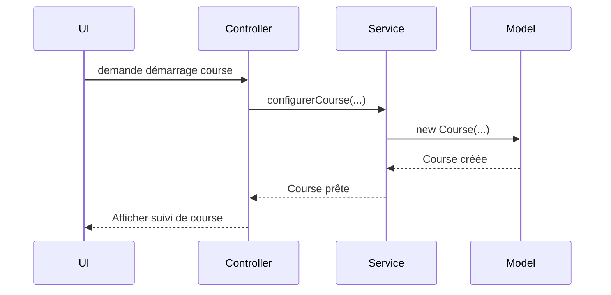

# Diagramme de séquence de base (Mermaid)

```mermaid
sequenceDiagram
    participant UI
    participant Controller
    participant Service
    participant Model

    UI->>Controller: demande démarrage course
    Controller->>Service: configurerCourse(...)
    Service->>Model: new Course(...)
    Model-->>Service: Course créée
    Service-->>Controller: Course prête
    Controller-->>UI: Afficher suivi de course
```
