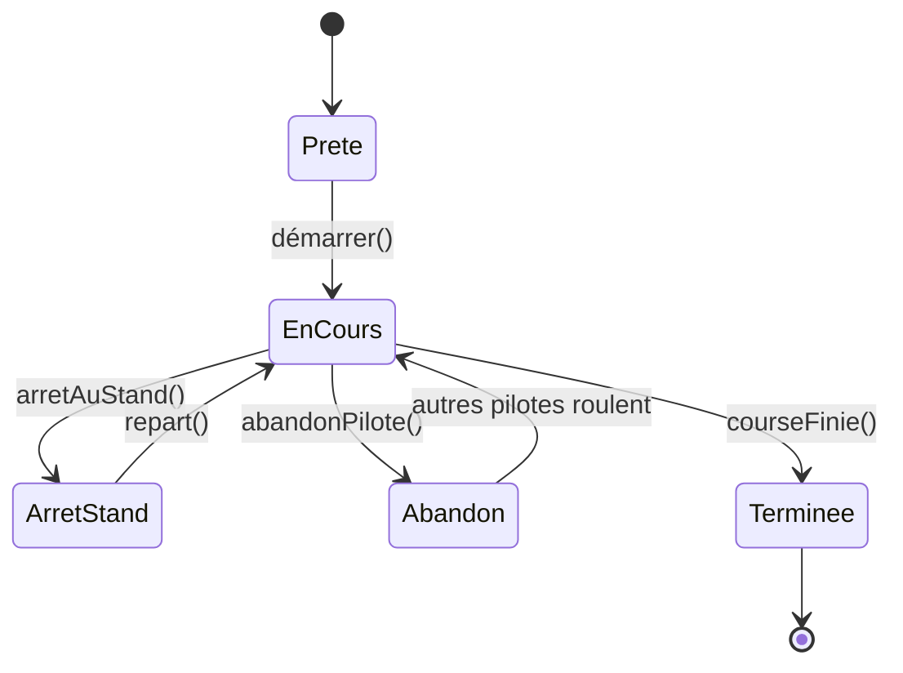

# Diagramme d'état (Mermaid)

```mermaid
stateDiagram-v2
    [*] --> Prete
    Prete --> EnCours : démarrer()
    EnCours --> ArretStand : arretAuStand()
    ArretStand --> EnCours : repart()
    EnCours --> Abandon : abandonPilote()
    EnCours --> Terminee : courseFinie()
    Abandon --> EnCours : autres pilotes roulent
    Terminee --> [*]
```
